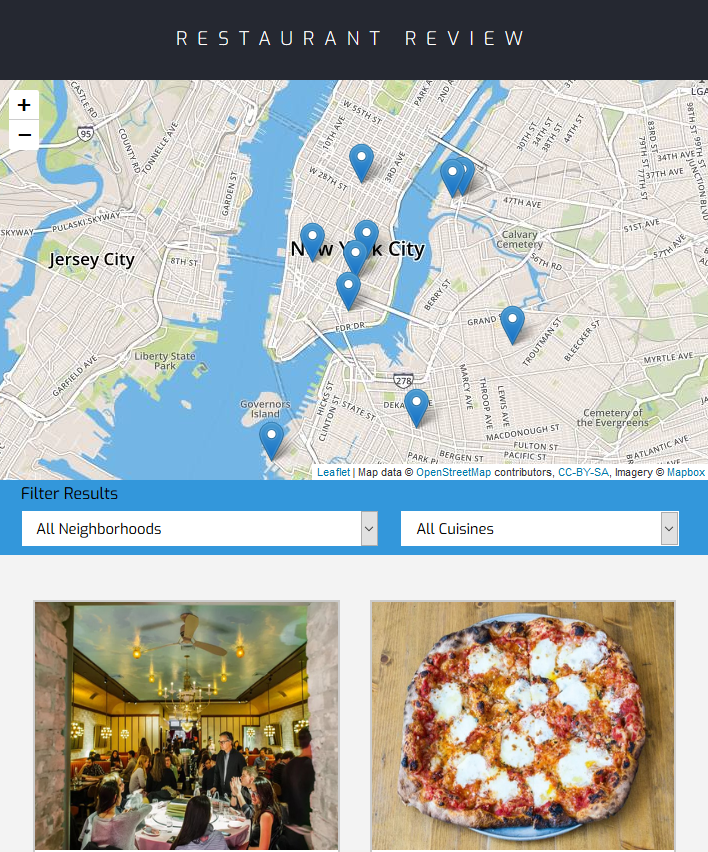

# Restaurant Review App Project

## What is Restaurant Review App Project

Restaurant Review App Project is a project with the goal to teach the student to learn Responsive Design, to learn the use of service worker to cache the page and learn how to implement Accessibility. This project it's part of the Udacity and Google's Front-End Web Developer NanoDegree.

### Screenshot

### Live Website

- Clone the repository
- Open your favourite command shell and `cd` into the folder
- Run the server using the following command:

**Python 2**

`python -m SimpleHTTPServer 8000`

**Python 3**

`python -m http.server 8000`

- Go to localhost:8000 to open the website.
- The main HTML page is /index.html
- The restaurant's details HTML page is /restaurant.html
- The CSS file is /css/styles.css
- The JS file for the main page is /js/main.js
- The JS file for the restaurant page is /js/restaurant_info.js
- The JS file to fetch the data from the server is /js/dbhelper.js
- The service worker is located in /sw.js and registered in the /js/main.js file.
- The images are located in/img

### External libraries Used

* jQuery
* Leaflet
* Normalize
